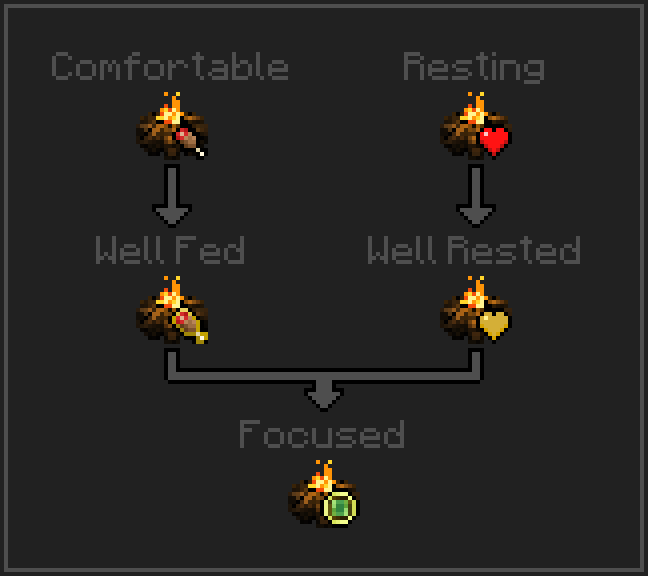

The Campfire has some beneficial effects to players within its range.

### Comfortable

When the player is within range of a Campfire at night, they will receive the Comfortable effect. A player with this effect will always be able to eat and will restore an additional 50% saturation from eating.

This effect will be lost if the player moves out of range of the campfire, it becomes daytime, or the player is within range of a hostile mob.

### Well Fed

When the player eats while under the influence of the Comfortable effect and their saturation exceeds full, the Well Fed effect will be applied. This effect will reduce the amount of exhaustion a player incurs until its duration expires.

This effect will be lost when its duration expires.

### Resting I, II, and III

When the player is within range of a Campfire at night, they will receive the Resting effect. A player with this effect will very slowly regen a trickle of health.

If the player stands still long enough with the Resting I effect, it will change to Resting II, and then finally Resting III. The effect will be reduced back to Resting I if the player deals damage, takes damage, or moves.  

This effect will be lost if the player moves out of range of the campfire, it becomes daytime, or the player is within range of a hostile mob.

### Well Rested

If the player stands still long enough while under the influence of Resting III, the Well Rested effect will be applied. This effect applies absorption hearts until its duration expires.

This effect will be lost when its duration expires or the absorption hearts are depleted.

### Focused

If the player stands still long enough while under the influence of Comfortable, Well Fed, Resting III, and Well Rested, the Focused effect will be applied. A player with the Focused effect will gain more experience.

If the player continues to stand still while under the influence of Comfortable, Well Fed, Resting III, Well Rested, and Focused, the Focused effect will accumulate experience bonus up to a configured maximum amount.

This effect will be lost when the accumulated experience bonus is depleted. 