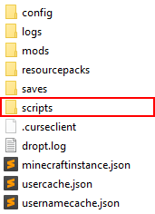

### Incorrect Block Drops

Affected MC versions: `1.12.2`

Pyrotech uses Dropt under the hood to manage its block drops based on tool type and harvest level. Some mods don't properly implement the right methods on their tools to return the proper tool type or harvest level. In this case, Dropt can't determine what type of tool or harvest level the player is using and the tool doesn't match causing incorrect block drops.

Here is a list of the known, affected mod items:

* EnderIO Dark Pick w/ Spoon Upgrade
* Erebus Jade Paxel
* GTCE Pickaxe and Shovel
* Mekanism Atomic Dissasembler

For more information, see the following issues:

* [pyrotech/issues/274](https://github.com/codetaylor/pyrotech/issues/274)
* [pyrotech/issues/279](https://github.com/codetaylor/pyrotech/issues/279)

### Shoulder Surfing Reloaded

**Issue: Crash**

Affected MC versions: `1.12.2`

Pyrotech is currently incompatible with Shoulder Surfing Reloaded.

For more information, see [this issue](https://github.com/codetaylor/pyrotech/issues/2).

### Thermal Expansion

**Issue: Missing Recipes**

Affected MC versions: `1.12.2`

Pyrotech removes recipes before Thermal Expansion has had a chance to run its scan and create its sawmill recipes. This results in the Thermal Expansion sawmill missing its six vanilla plank recipes.

Efforts were made to resolve the problem by changing when the recipes are removed, but in the long run, this caused [a number of cascading issues](https://github.com/codetaylor/pyrotech/issues/97) that grew increasingly harder and increasingly hackier to solve. These changes have since been reverted.

**Solutions**

At this time I don't see a way to cleanly resolve this, but there are a couple of solutions that might help: stop Pyrotech from removing the wood recipes or add the missing Thermal Expansion recipes.

**Stop Pyrotech from Removing Recipes**

The first solution is to go into the `config/pyrotech/core.cfg` file, locate the `recipes` section and delete the wood recipes from the list `VANILLA_CRAFTING_REMOVE`. This will stop Pyrotech from removing the wood recipes and Thermal Expansion will be able to automatically generate its wood recipes again. This also means, though, that the log to plank vanilla recipes will be available in vanilla crafting again and it will then be up to you what to do from there.

**Add the Missing Recipes**

The second solution is to use the mod [ModTweaker](https://www.curseforge.com/minecraft/mc-mods/modtweaker) and ZenScript to add the recipes back to Thermal Expansion.

Below is a prepared script that should match the Thermal Expansion defaults pretty well. You can copy and paste its contents into a file `thermalexpansion.zs` and place it inside of the `scripts` folder in your instance folder. If you don't have a `scripts` folder go ahead and create one and place it directly inside of your instance folder, ie. in the parent folder of the `config` folder.



```
import mods.thermalexpansion.Sawmill;

// Sawmill.addRecipe(IItemStack output, IItemStack input, int energy, @Optional IItemStack secondaryOutput, @Optional int secondaryChance);
Sawmill.addRecipe(<minecraft:planks:0> * 6, <minecraft:log:0>, 1000, <thermalfoundation:material:800>, 100);
Sawmill.addRecipe(<minecraft:planks:1> * 6, <minecraft:log:1>, 1000, <thermalfoundation:material:800>, 100);
Sawmill.addRecipe(<minecraft:planks:2> * 6, <minecraft:log:2>, 1000, <thermalfoundation:material:800>, 100);
Sawmill.addRecipe(<minecraft:planks:3> * 6, <minecraft:log:3>, 1000, <thermalfoundation:material:800>, 100);
Sawmill.addRecipe(<minecraft:planks:4> * 6, <minecraft:log2:0>, 1000, <thermalfoundation:material:800>, 100);
Sawmill.addRecipe(<minecraft:planks:5> * 6, <minecraft:log2:1>, 1000, <thermalfoundation:material:800>, 100);
```

See also: [ModTweaker Wiki](https://docs.blamejared.com/en/#Mods/Modtweaker/ThermalExpansion/Sawmill/)