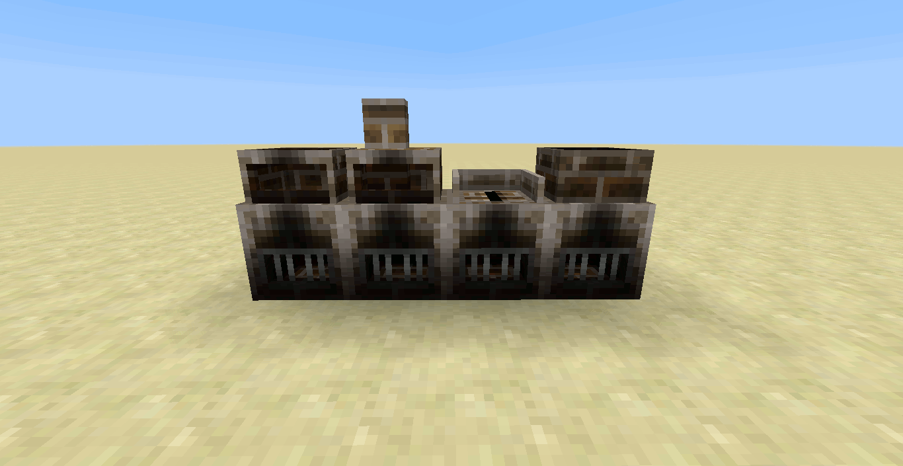

!!! note "Pyrotech in 1.14.4 and beyond!"
    Hi, I'm Codetaylor, the creator of Pyrotech and I would love to work on moving the mod to more recent versions of Minecraft. If you'd like to see Pyrotech move beyond 1.12.2, [click here to read more about my campaign to make that happen](https://bit.ly/2KaxA3Hd)!

## Alternate Textures

The refractory, or brick, machines each have an alternate texture.

By default, the machines look like they are partly made from iron, but this may not fit thematically with your pack's progression.

Each device can have its texture toggled in `module.tech.Machine.cfg`, search for `USE_IRON_SKIN`.

